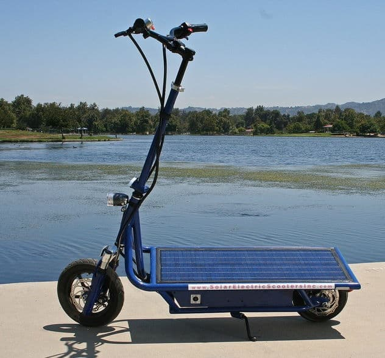
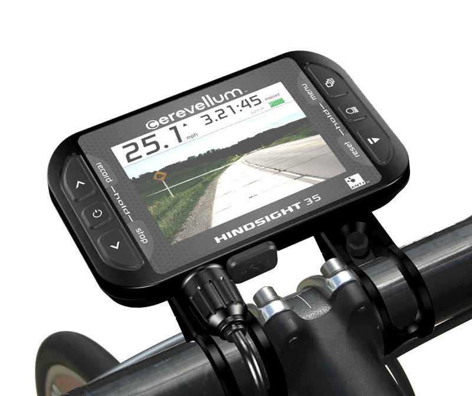
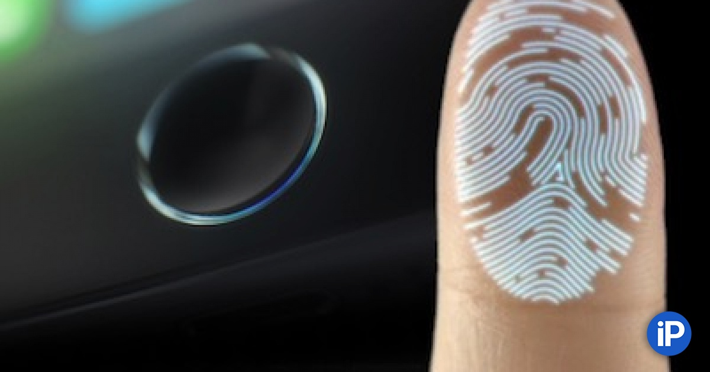

**Смарт самокат**
****

**Идея**:

**Запуск стартапа шеринга самокатов**

В рамках проекта мы создадим смарт самокат на солнечной батарее, с имеющимся в строенным модулем GPS и ГЛОНАС, навигатором и разблокировкой по отпечатку пальца.

****
**Прототип**

****

****

****

**Процесс разработки**
****
1. Основой является обычный электросамокат.

+ Продукт уже готов к использованию.

+ Не требует полной спецификации требований.

+ Уменьшается время , затраченное на тестирование продукта.

+ Позволяет привлечь к проекту реальных пользователей в качестве проводников, которые помогут скорректировать бизнес-модель и базовые характеристики будущего продукта.

+ Тем самым мы получаем хорошие результаты на стадии MVP, которые дают зеленый свет для разработки полной версии продукта.

2 **Создается мобильное приложение, с помощью которого происходит активация самоката через отпечаток пальца.**

+ Регистрация пользователя в мобильном приложении осуществляется через е-mail,тем самым мы получаем возможность обратной связи проведением опросов пользователями с помощью рассылок на e-mail.
 
+ Создание кнопки-виджет в приложении для быстрой коммуникации с пользователем.

3 **Навигатор с картой города.**

+ Позволит пользователю быстро и комфортно добирать в необходимые точки города, даже не зная его.

4 **Замена обычно батареи на солнечную**

+ Увеличение запаса хода без подзарядки с 4-6 часов , до 12-18.

+ Экологичность и простота в обслуживании

5 Глонас и GPS трекеры

+ Позволит видеть расположение самоката даже при полном разряде батареи

+ Помогает более точно ориенироваться навигатору и приложению

**Конечная цель:**
****
Повышение прибыли от проката самокатов, за счет экологичности, увеличения автономной работы и дешевизной обслуживания.